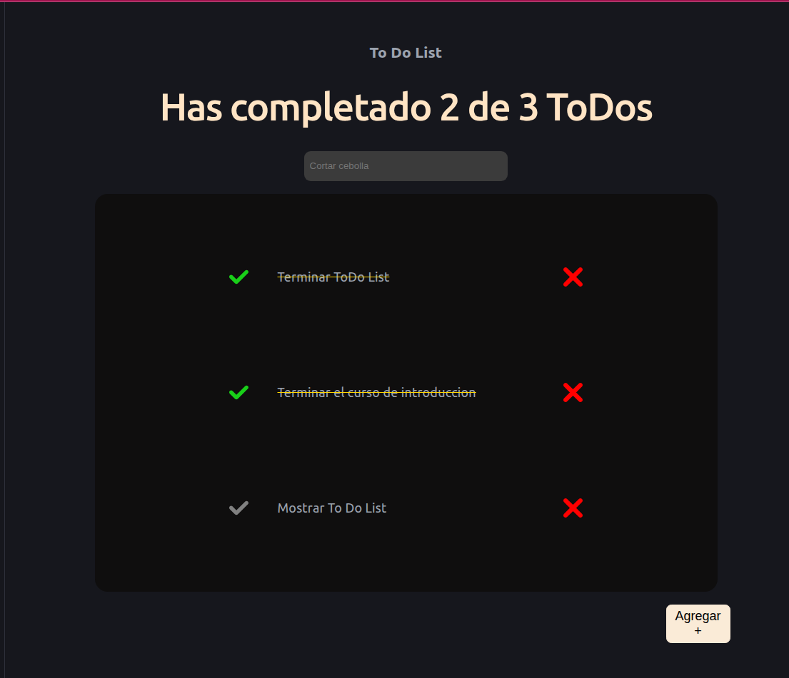

# 📝 ToDo List - React

Aplicación web desarrollada con **React** que permite gestionar una lista de tareas de forma sencilla e intuitiva.

## 📸 Vista previa

> https://atziry-cuxil.github.io/ToDoListReact/

---

## 🚀 Características

- ✅ Agregar nuevas tareas.
- ✔️ Marcar tareas como completadas.
- ❌ Eliminar tareas.
- 📊 Contador dinámico de tareas completadas.
- 🎨 Interfaz moderna con tema oscuro.
- ⚡ Actualización de la interfaz en tiempo real mediante React.

---

## 📖 Uso

1. Escribe una nueva tarea en el campo de texto.
2. Presiona el botón **Agregar**.
3. Marca una tarea como completada haciendo clic en el icono ✔️.
4. Elimina una tarea con el icono ❌.
5. El contador superior se actualizará automáticamente mostrando el progreso.
---

## 👨‍💻 Autores

Proyecto desarrollado como práctica de **React**.

